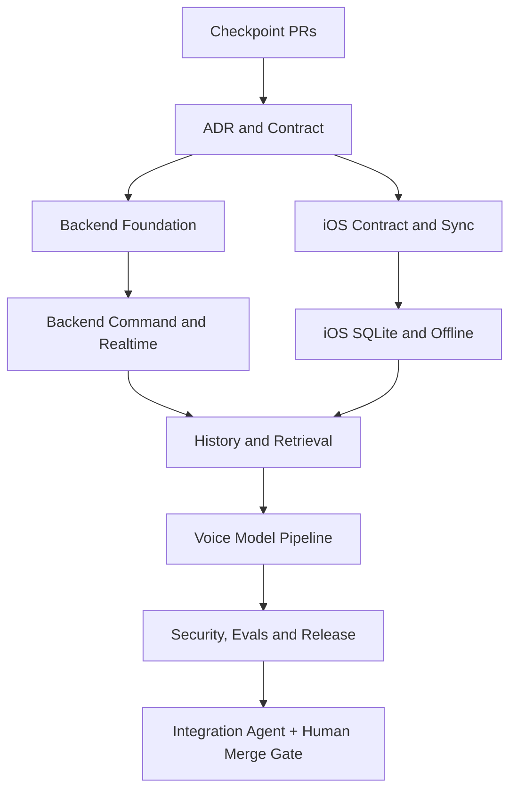

# Knock Knock Implementation Roadmap

> **Purpose:** execution playbook for the 40 accepted architecture decisions.
> The canonical decisions live in `ARCHITECTURE_DECISIONS.md`; this document
> defines agent boundaries, handoffs, verification, and release gates.

## Execution status — 2026-08-12

The architecture, data, sync, history, command-safety, staging, and UI
checkpoints are merged. The only bases for the current paired voice work are:

| Repository | Merged base | Current completion branch | Status |
|---|---|---|---|
| Backend | `bbb4a82` ([PR #29](https://github.com/wchklaus97/knock-knock-backend/pull/29)) | `agent/reject-unqualified-270m-20260812` | Voice backend merged; fail-closed 270M follow-up pending review; not deployed |
| iOS | `1757009` ([PR #15](https://github.com/wchklaus97/knock-knock-frontend/pull/15)) | `agent/voice-goal-completion-ios-20260812` ([PR #17](https://github.com/wchklaus97/knock-knock-frontend/pull/17)) | Model safety and verified voice workflow pending review; not distributed |

The protected staging deploy and contract workflows passed for the previously
deployed backend checkpoint, and 20 consecutive health probes passed. Backend
PR #29 is now merged but has not been deployed by this work. The current iOS
PR and backend model-policy follow-up
add strict app-owned command canonicalization, backend-owned presentation,
crash-safe pre-POST SQLite checkpoint/replay, one-time confirmation-token
rotation, lightweight command summaries, authenticated private-R2 model
delivery, signed release tooling, and a 32-example multilingual golden fixture.

Gemma 3 1B now has ≥95%/zero-high-risk-false-execution evidence on iPhone 17
Pro Max. The evaluated 270M tier is rejected at 0.500 accuracy and its
acquisition path fails closed; iPhone 13 keeps deterministic parsing plus
clarification. Remaining external gates are production trust-key approval,
private staging-R2 publication, microphone/memory/thermal/crash UAT, real APNs delivery, simultaneous
two-physical-device convergence, provider sandbox approval, paired PR review,
and human approval of deployment, secrets, migrations, and model rollout.

The detailed evidence and rollback record is in
`docs/RELEASE_VERIFICATION_REPORT.md`.
The numbered release handoff is in `docs/RELEASE_GATE_MATRIX.md`.

### Contract parity checkpoint

Merged PR #12 aligned OpenAPI with the 47 executable operations at that point.
The current private model-artifact route is the 48th operation; the same parity
smoke covers it. The paired voice PRs must be reviewed before any generated
client treats `CommandPresentation` as required.

### Backend follow-up checkpoint — 2026-08-10

The next backend continuation closes four concrete API gaps in one additive
checkpoint: command list pagination, push dismissal, pairing status, and rich
action descriptors. It also adds the `0011_command_pairing_action_descriptors`
migration, claim-token fencing, provider-mode/feature-flag configuration,
provider attempt failure states, secret-shaped argument rejection, and
idempotent versioned Undo.

The current local worktree has passed the Rust/WASM/static gates and a real
local Worker + local D1 contract smoke on an isolated port. It has also run the
three local vertical effects through `/__scheduled`: reminder and draft become
durable D1 effects, while message remains explicitly `queued` with
`external_delivery: not_configured`.

This checkpoint now includes a generic secret-authenticated HTTPS provider
adapter for reminder/message delivery, a local reminder due-time scanner with
deduplicated pushes, a scheduled retention sweep, a staging configuration
template, and a formal contract-breaking compatibility smoke. The adapter now
requires delivery/status lifecycle endpoints for enabled production actions;
external reminder Undo calls the provider cancellation endpoint, and timeout
results are reconciled through provider status. A provider attempt is persisted
before the external call, so a Worker restart must reconcile the same key
before retrying. Asynchronous message acceptance remains queued/unknown until
status reports delivery, while an external reminder without a provider
identifier fails closed so Undo cannot claim a cancellation it cannot perform.
It was verified against a local mock provider for delivery, cancellation,
timeout, asynchronous message status recovery, and user/action-scoped provider
idempotency keys.
Cancellation now requires an explicit terminal provider state and a durable
per-operation fence; retryable Outbox exhaustion remains `unknown` for
reconciliation instead of becoming a false terminal failure.
Cancellation fences also recover after a bounded stale lease, so a Worker
crash cannot leave an Undo operation permanently stuck. Request correlation
accepts only validated `X-Request-ID` values, rate limiting and audit metadata
use the trusted Cloudflare edge IP header, and `/metrics` exposes provider,
APNs, and model readiness gauges.
The R2 retrieval download route is also implemented and verified with a local
R2 object plus cross-user isolation. Provider vendor selection, sandbox
evidence, production credentials, remote staging D1/Worker/R2 E2E, formal
security/observability review, and human merge/deployment approval remain
release work.

### Active Phase 4/5 completion branch

The follow-up branch now extends the earlier staged work with:

- durable `reminders`, `drafts`, and `outbound_messages` effects keyed by
  command and protected by provider-idempotency records;
- real reminder/draft undo and an explicit internal message queue result;
- `GET /v1/phone/models/{model_id}` plus production model configuration checks;
- an iOS 15 system on-device STT path, push-to-talk controller, the official
  LiteRT-LM 0.12 C-framework Gemma command generator, signed artifact store,
  and rollback-aware manager;
- an authenticated same-origin `GET /v1/phone/models/{model_id}/artifact`
  private-R2 stream, disk-backed Wi-Fi-safe iOS download, Ed25519 release
  script, and `docs/VOICE_MODEL_RELEASE_RUNBOOK.md`;
- strict model-draft canonicalization that replaces model-owned IDs, locale,
  timezone, device, and model version with trusted app context before POST;
- a 32-example English, Chinese, and Cantonese golden fixture including
  ambiguity and prompt-injection cases, with opt-in signed real-model metrics;
- backend-only `CommandPresentation` for privacy-safe UI/TTS, command-list
  summaries without raw results/errors, and an iOS SQLite checkpoint written
  before POST for crash-safe replay and monotonic REST reconciliation;
- exact idempotent high-risk create replay that rotates the one active
  confirmation token while retaining invalidated token audit records;
- a static `scripts/phase45-release-gate.sh` that runs Rust, contract,
  migration, adversarial, provider-safety, configuration, compatibility, and
  secret-hygiene checks;
- `migrations/0012_reminder_delivery_state.sql`, a leaseable local reminder
  notifier, a deduplicated push path, and a scheduled message/retrieval
  retention sweep;
- an authenticated `GET /v1/phone/retrievals/{retrieval_id}/download` R2
  stream with retention/ownership checks, user-namespaced keys, shared-key
  retention protection, no internal-key disclosure, and a dedicated download
  rate-limit category;
- provider delivery/status/cancel endpoints with timeout reconciliation and
  local dynamic smoke scripts in `scripts/r2-download-smoke.sh` and
  `scripts/provider-lifecycle-smoke.sh`;
- high-entropy pairing tokens with a dedicated unauthenticated rate-limit
  bucket, non-development legacy JWT fail-closed configuration, privacy-light
  APNs payloads, encrypted private-R2 production backup workflow, and model
  manifest shape/integrity validation;
- `wrangler.staging.toml.example`, with staging fail-closed validation and
  external action flags disabled by default, plus explicit R2 and provider
  lifecycle placeholders. The staging gate can now run the R2 route smoke
  remotely after materializing this config.
- user/operation-scoped Outbox idempotency keys, bounded local reminder stale
  lease recovery, and a deleted-session barrier for local due notifications.

This does not close release by itself. The official WhisperKit package is not
linked while the app deployment floor remains iOS 15; the current default STT
is Apple's on-device Speech framework. A human must accept the Gemma license
and supply the signed artifact and pinned iOS public key. Real-model,
real-device voice, APNs/two-device, provider, security, paired review, and
human rollout approval remain explicit gates.

## Operating rules

1. The existing iOS and backend checkpoint PRs are the baseline. Do not add
   large feature work to those branches.
2. Each phase has one backend PR and one iOS PR. Phase branches are stacked on
   the previous phase until the checkpoint PRs are merged.
3. Agents use isolated worktrees and disjoint write scopes. An agent must not
   edit a file owned by another active agent.
4. Agents may edit, test, commit, push, and create draft PRs. They may not
   merge, deploy, apply a production migration, rotate production secrets, or
   publish a model.
5. Every handoff includes changed paths, commit SHA, tests, migration IDs,
   compatibility impact, blockers, and rollback steps.
6. The Control Tower/integration agent is the only agent that declares a phase
   ready for human merge.

## Agent topology



## Ownership matrix

| Role | Write scope | Output |
|---|---|---|
| Control Tower | orchestration metadata only | dependency status and merge recommendation |
| ADR/Contract | backend `docs/`, backend `contracts/` | decisions, roadmap, OpenAPI and schemas |
| Backend Foundation | migrations, `src/models.rs`, `src/db.rs` | additive schema and scoped data access |
| Backend Command | command/action modules and command tests | lifecycle, idempotency, confirmation, undo, outbox |
| Backend Realtime | route/SSE/push/rate-limit modules | `phone_changes`, cursor sync, notification hints |
| iOS Sync | `APIClient.swift`, `AppStore.swift`, `Models.swift` | REST/SSE reconciliation and compatibility decoding |
| iOS Persistence | new SQLite store and persistence tests | cached data, cursor, pending queue, local migrations |
| History/Retrieval | backend message/retrieval modules and iOS detail/search UI | history, sources, search, export, retention |
| Voice Model | new voice/model files and Xcode model integration | push-to-talk, STT, intent, TTS, signed model manager |
| Verification | test fixtures, eval reports, read-only review | contract, security, performance, golden-data results |
| Integration | no feature-file ownership | cross-repo smoke report and phase gate |

## Phase gates

### Phase 0 — Documentation and contract

Deliver:

- `docs/ARCHITECTURE_DECISIONS.md`
- `docs/IMPLEMENTATION_ROADMAP.md`
- `docs/AGENT_HANDOFF_TEMPLATE.md`
- `contracts/openapi.yaml`
- contract structural smoke test
- iOS pointers to the backend canonical documents

Gate:

- Markdown and YAML checks pass.
- D01–D40 are present exactly once.
- Existing iOS response fixtures remain decodable.
- No Swift, Rust, migration, or production configuration changes are mixed in.

### Phase 1 — Backend data and command safety

Deliver additive migrations and code for commands, confirmation tokens,
messages, retrieval metadata, phone changes, outbox, action attempts, retention
fields, push read state, and user-scoped indexes.

Required behavior:

- command state machine is enforced server-side;
- idempotency is unique per user/command scope;
- confirmation token is one-time and hash-bound;
- state, event, audit, and phone change are committed atomically;
- external effects are recorded before an Outbox worker attempts them.

Gate:

- Rust unit tests, migration smoke, duplicate/concurrency tests, ownership
  tests, token replay tests, and WASM check pass.

### Phase 2 — Realtime, sync, and offline iOS

Backend replaces the timestamp-only SSE cursor with durable `phone_changes` and
adds sync/list/detail/message endpoints while preserving old routes.

iOS adds a system SQLite persistence layer because the deployment floor is iOS
15, moves pending operations and cursor state out of `UserDefaults`, and makes
foreground/background SSE reconciliation explicit.

Gate:

- reconnect, missed-event, terminated-app, multi-device, offline retry, and
  one-SSE-per-device tests pass;
- iOS 15 simulator build and tests pass;
- old checkpoint API fixtures still pass.

### Phase 3 — History, retrieval, and product completeness

Deliver messages, retrieval snapshots, cursor pagination, search, export,
archive/rename/cancel/retry/delete, push read state, retention, tombstones,
R2 references, and the corresponding iOS summary/detail/cache UI.

Gate:

- no pagination duplicates or gaps;
- deletion cannot be resurrected by another device;
- source snapshots remain explainable after the source changes;
- cross-user and R2 authorization tests pass.

### Phase 4 — Local voice pipeline

Deliver push-to-talk, VAD, recognizer/intent/TTS adapters, signed model
manifest, capability tiers, low-confidence clarification, locale/timezone
metadata, and the three vertical actions: read-only, reversible, and
high-risk-confirmed.

Gate:

- golden dataset has 20–100 examples;
- intent accuracy is at least 95%;
- high-risk false execution and duplicate side effects are zero;
- iPhone 13 memory/thermal/crash checks pass;
- model hash/signature/rollback checks pass.

### Phase 5 — Security, operations, and release

Deliver Supabase Auth contract coverage, credential isolation, rate limits,
structured errors, tracing, metrics, retry/backoff, unknown-outcome
reconciliation, feature flags, deletion verification, and rollout reports.

Gate:

- backend and iOS paired PRs are green;
- contract, security, E2E, model, and performance reports are attached;
- human approves merge, production migration, APNs changes, and model rollout.

## Verification matrix

| Layer | Required checks |
|---|---|
| Contract | OpenAPI 3.1 lint/structure, required fields, enum checks, breaking diff |
| Backend | `cargo fmt --check`, `cargo check --target wasm32-unknown-unknown`, unit tests, contract smoke, migration smoke |
| iOS | iOS 15 simulator build/tests, model decoding fixtures, SQLite migration tests, SSE lifecycle tests |
| Security | auth expiry, ownership, confirmation replay, secret scan, retrieval prompt-injection fixtures |
| Reliability | idempotency/concurrency, cursor gap recovery, Outbox retry/unknown, APNs loss, multi-device convergence |
| AI | golden dataset, structured-output assertions, human review of early traces, latency/memory/thermal metrics |
| Release | feature-flag rollback, forward-only migration evidence, draft PR review, human merge gate |

## Standard handoff

Every agent writes the following into its draft PR description:

```text
Phase: P<n>
Role:
Base branch:
Commit:
Changed paths:
Decision IDs:
Contract/migration IDs:
Tests run and results:
Compatibility behavior:
Known limitations:
Rollback steps:
Next dependent agent:
```

## Rollback rules

- Database changes are additive first; removal waits for old-client retirement.
- API adapters remain until the migration gate is explicitly closed.
- Feature flags disable new command, retrieval, or model paths without deleting
  existing state.
- Failed Outbox work moves to retry/unknown/dead-letter state; it is never
  silently discarded.
- Model downloads use the last verified manifest on failure.
- Production changes require an explicit human approval record.
