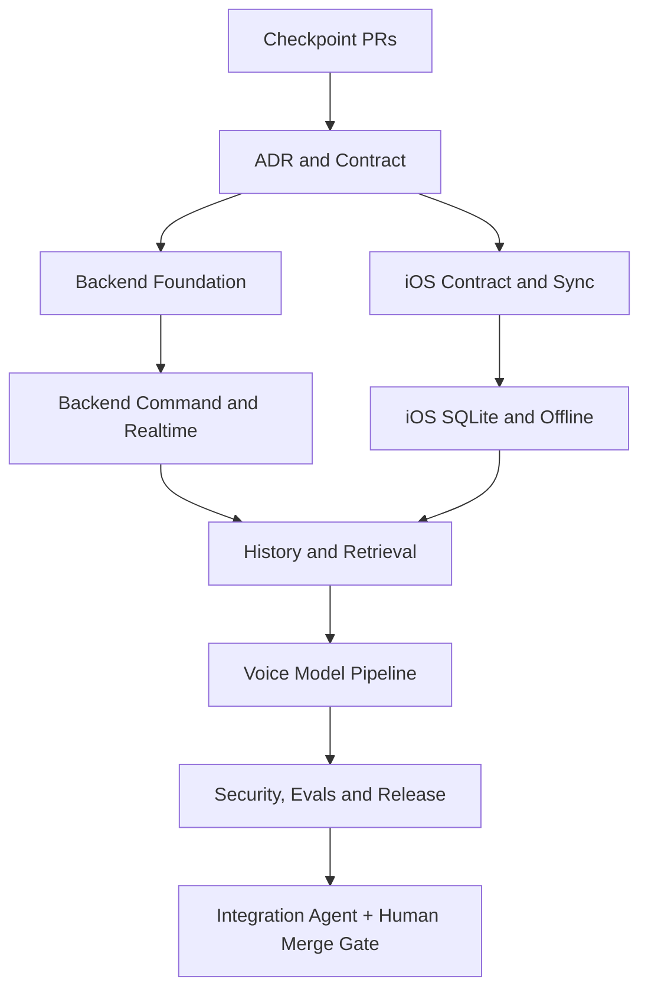

# Knock Knock Implementation Roadmap

> **Purpose:** execution playbook for the 40 accepted architecture decisions.
> The canonical decisions live in `ARCHITECTURE_DECISIONS.md`; this document
> defines agent boundaries, handoffs, verification, and release gates.

## Execution status — 2026-08-09

The staged implementation is in draft-PR review and has not been merged or
deployed. The current dependency chain is:

| Stage | Backend | iOS | Status |
|---|---|---|---|
| Checkpoint | [PR #1](https://github.com/wchklaus97/knock-knock-backend/pull/1) | [PR #1](https://github.com/wchklaus97/knock-knock-frontend/pull/1) | Baseline, human merge required |
| Phase 0 | [PR #2](https://github.com/wchklaus97/knock-knock-backend/pull/2) | [PR #2](https://github.com/wchklaus97/knock-knock-frontend/pull/2) | Documents and contract complete |
| Phase 1 | [PR #3](https://github.com/wchklaus97/knock-knock-backend/pull/3) | — | Foundation implementation complete |
| Phase 2 | — | [PR #3](https://github.com/wchklaus97/knock-knock-frontend/pull/3) | SQLite/offline implementation complete |
| Phase 3 | [PR #4](https://github.com/wchklaus97/knock-knock-backend/pull/4), [hardening PR #6](https://github.com/wchklaus97/knock-knock-backend/pull/6) | [PR #4](https://github.com/wchklaus97/knock-knock-frontend/pull/4) | History/retrieval and deletion hardening complete |
| Phase 4 | — | [PR #5](https://github.com/wchklaus97/knock-knock-frontend/pull/5), [command API PR #7](https://github.com/wchklaus97/knock-knock-frontend/pull/7) | Local voice boundary and command submission complete |
| Phase 5 | [integrated PR #8](https://github.com/wchklaus97/knock-knock-backend/pull/8) | [release PR #6](https://github.com/wchklaus97/knock-knock-frontend/pull/6), [command API PR #7](https://github.com/wchklaus97/knock-knock-frontend/pull/7) | Security/release integration in review |

Verified in the current integration branches: OpenAPI and migration smoke,
adversarial SQL isolation/deletion/lease tests, Rust unit tests, Rust WASM
check, strict Clippy, iOS 15 simulator tests, and generic iOS build. Remaining
human release gates are route-level D1/E2E tests against deployed bindings,
security review, the 20–100 example golden voice dataset with device
performance evidence, breaking-contract diff review, and approval of merge,
production migrations, APNs changes, and model rollout.

The detailed evidence and rollback record is in
`docs/RELEASE_VERIFICATION_REPORT.md`.

### Backend follow-up checkpoint — 2026-08-10

The next backend continuation closes four concrete API gaps in one additive
checkpoint: command list pagination, push dismissal, pairing status, and rich
action descriptors. It also adds the `0011_command_pairing_action_descriptors`
migration, claim-token fencing, provider-mode/feature-flag configuration,
provider attempt failure states, secret-shaped argument rejection, and
idempotent versioned Undo.

The current local worktree has passed the Rust/WASM/static gates and a real
local Worker + local D1 contract smoke on an isolated port. It has also run the
three local vertical effects through `/__scheduled`: reminder and draft become
durable D1 effects, while message remains explicitly `queued` with
`external_delivery: not_configured`.

This checkpoint is not a production provider delivery. A concrete external
reminder/message adapter, due-time scanner, deployed-binding E2E, CI security
review, and human merge/deployment approval remain release work.

### Active Phase 4/5 completion branch

The follow-up branch now extends the earlier staged work with:

- durable `reminders`, `drafts`, and `outbound_messages` effects keyed by
  command and protected by provider-idempotency records;
- real reminder/draft undo and an explicit internal message queue result;
- `GET /v1/phone/models/{model_id}` plus production model configuration checks;
- an iOS 15 system on-device STT path, push-to-talk controller, the official
  LiteRT-LM 0.12 C-framework Gemma command generator, signed artifact store,
  and rollback-aware manager;
- a static `scripts/phase45-release-gate.sh` that runs Rust, contract,
  migration, adversarial, configuration, and secret-hygiene checks.

This does not close release by itself. The official WhisperKit package is not
linked while the app deployment floor remains iOS 15; a signed model artifact,
the pinned iOS public key, deployed D1/E2E checks, real-device voice evidence,
security review, and human approval are still explicit gates.

## Operating rules

1. The existing iOS and backend checkpoint PRs are the baseline. Do not add
   large feature work to those branches.
2. Each phase has one backend PR and one iOS PR. Phase branches are stacked on
   the previous phase until the checkpoint PRs are merged.
3. Agents use isolated worktrees and disjoint write scopes. An agent must not
   edit a file owned by another active agent.
4. Agents may edit, test, commit, push, and create draft PRs. They may not
   merge, deploy, apply a production migration, rotate production secrets, or
   publish a model.
5. Every handoff includes changed paths, commit SHA, tests, migration IDs,
   compatibility impact, blockers, and rollback steps.
6. The Control Tower/integration agent is the only agent that declares a phase
   ready for human merge.

## Agent topology



## Ownership matrix

| Role | Write scope | Output |
|---|---|---|
| Control Tower | orchestration metadata only | dependency status and merge recommendation |
| ADR/Contract | backend `docs/`, backend `contracts/` | decisions, roadmap, OpenAPI and schemas |
| Backend Foundation | migrations, `src/models.rs`, `src/db.rs` | additive schema and scoped data access |
| Backend Command | command/action modules and command tests | lifecycle, idempotency, confirmation, undo, outbox |
| Backend Realtime | route/SSE/push/rate-limit modules | `phone_changes`, cursor sync, notification hints |
| iOS Sync | `APIClient.swift`, `AppStore.swift`, `Models.swift` | REST/SSE reconciliation and compatibility decoding |
| iOS Persistence | new SQLite store and persistence tests | cached data, cursor, pending queue, local migrations |
| History/Retrieval | backend message/retrieval modules and iOS detail/search UI | history, sources, search, export, retention |
| Voice Model | new voice/model files and Xcode model integration | push-to-talk, STT, intent, TTS, signed model manager |
| Verification | test fixtures, eval reports, read-only review | contract, security, performance, golden-data results |
| Integration | no feature-file ownership | cross-repo smoke report and phase gate |

## Phase gates

### Phase 0 — Documentation and contract

Deliver:

- `docs/ARCHITECTURE_DECISIONS.md`
- `docs/IMPLEMENTATION_ROADMAP.md`
- `docs/AGENT_HANDOFF_TEMPLATE.md`
- `contracts/openapi.yaml`
- contract structural smoke test
- iOS pointers to the backend canonical documents

Gate:

- Markdown and YAML checks pass.
- D01–D40 are present exactly once.
- Existing iOS response fixtures remain decodable.
- No Swift, Rust, migration, or production configuration changes are mixed in.

### Phase 1 — Backend data and command safety

Deliver additive migrations and code for commands, confirmation tokens,
messages, retrieval metadata, phone changes, outbox, action attempts, retention
fields, push read state, and user-scoped indexes.

Required behavior:

- command state machine is enforced server-side;
- idempotency is unique per user/command scope;
- confirmation token is one-time and hash-bound;
- state, event, audit, and phone change are committed atomically;
- external effects are recorded before an Outbox worker attempts them.

Gate:

- Rust unit tests, migration smoke, duplicate/concurrency tests, ownership
  tests, token replay tests, and WASM check pass.

### Phase 2 — Realtime, sync, and offline iOS

Backend replaces the timestamp-only SSE cursor with durable `phone_changes` and
adds sync/list/detail/message endpoints while preserving old routes.

iOS adds a system SQLite persistence layer because the deployment floor is iOS
15, moves pending operations and cursor state out of `UserDefaults`, and makes
foreground/background SSE reconciliation explicit.

Gate:

- reconnect, missed-event, terminated-app, multi-device, offline retry, and
  one-SSE-per-device tests pass;
- iOS 15 simulator build and tests pass;
- old checkpoint API fixtures still pass.

### Phase 3 — History, retrieval, and product completeness

Deliver messages, retrieval snapshots, cursor pagination, search, export,
archive/rename/cancel/retry/delete, push read state, retention, tombstones,
R2 references, and the corresponding iOS summary/detail/cache UI.

Gate:

- no pagination duplicates or gaps;
- deletion cannot be resurrected by another device;
- source snapshots remain explainable after the source changes;
- cross-user and R2 authorization tests pass.

### Phase 4 — Local voice pipeline

Deliver push-to-talk, VAD, recognizer/intent/TTS adapters, signed model
manifest, capability tiers, low-confidence clarification, locale/timezone
metadata, and the three vertical actions: read-only, reversible, and
high-risk-confirmed.

Gate:

- golden dataset has 20–100 examples;
- intent accuracy is at least 95%;
- high-risk false execution and duplicate side effects are zero;
- iPhone 13 memory/thermal/crash checks pass;
- model hash/signature/rollback checks pass.

### Phase 5 — Security, operations, and release

Deliver Supabase Auth contract coverage, credential isolation, rate limits,
structured errors, tracing, metrics, retry/backoff, unknown-outcome
reconciliation, feature flags, deletion verification, and rollout reports.

Gate:

- backend and iOS paired PRs are green;
- contract, security, E2E, model, and performance reports are attached;
- human approves merge, production migration, APNs changes, and model rollout.

## Verification matrix

| Layer | Required checks |
|---|---|
| Contract | OpenAPI 3.1 lint/structure, required fields, enum checks, breaking diff |
| Backend | `cargo fmt --check`, `cargo check --target wasm32-unknown-unknown`, unit tests, contract smoke, migration smoke |
| iOS | iOS 15 simulator build/tests, model decoding fixtures, SQLite migration tests, SSE lifecycle tests |
| Security | auth expiry, ownership, confirmation replay, secret scan, retrieval prompt-injection fixtures |
| Reliability | idempotency/concurrency, cursor gap recovery, Outbox retry/unknown, APNs loss, multi-device convergence |
| AI | golden dataset, structured-output assertions, human review of early traces, latency/memory/thermal metrics |
| Release | feature-flag rollback, forward-only migration evidence, draft PR review, human merge gate |

## Standard handoff

Every agent writes the following into its draft PR description:

```text
Phase: P<n>
Role:
Base branch:
Commit:
Changed paths:
Decision IDs:
Contract/migration IDs:
Tests run and results:
Compatibility behavior:
Known limitations:
Rollback steps:
Next dependent agent:
```

## Rollback rules

- Database changes are additive first; removal waits for old-client retirement.
- API adapters remain until the migration gate is explicitly closed.
- Feature flags disable new command, retrieval, or model paths without deleting
  existing state.
- Failed Outbox work moves to retry/unknown/dead-letter state; it is never
  silently discarded.
- Model downloads use the last verified manifest on failure.
- Production changes require an explicit human approval record.
